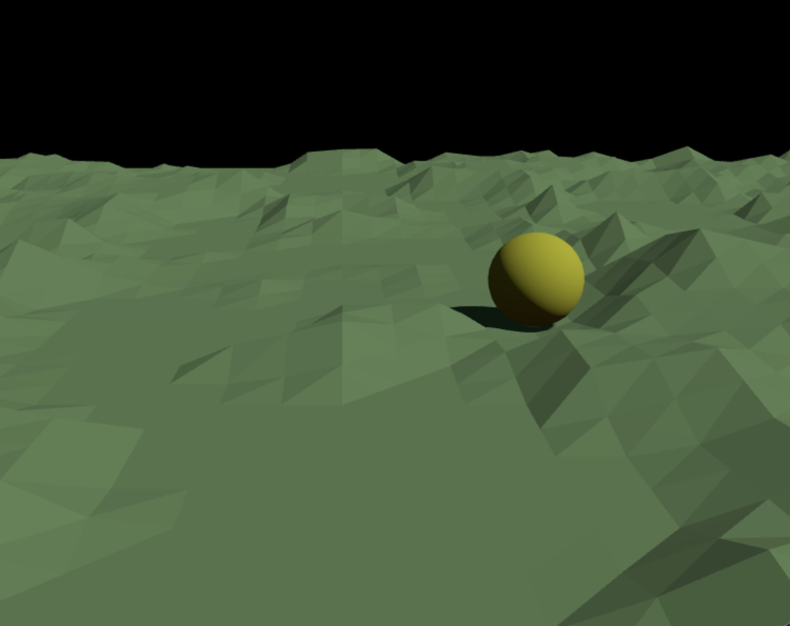

# demo-rapier-three

This repo provides a working example of rendering using [three.js](https://threejs.org/) and
physics simulation using [rapier3d](https://rapier.rs/).




This package also demonstrates how to organize a non-trivial three.js project with a bundler.
Many three.js examples consists of a single HTML file with script tags, which is not a great
starting point for someone interested in writing a serious game or application. This repo
demonstrates how to integrate with several popular JavaScript tools and libraries:

* [npm](https://www.npmjs.com/)
* [TypeScript](https://www.typescriptlang.org/)
* [Vite](https://vitejs.dev/)
* [ESLint](https://eslint.org/)
* [Prettier](https://prettier.io/)
* [React](https://reactjs.org/)

In general, the code strives to conform to industry standard practices for commercial JavaScript
application development.

# Getting Started

After checking out the repo:

```
npm install
npm start
```

Then navigate your browser to `localhost:4000`.

# Hot reloading

The sample app demonstrates how to integrate Vite's 'hot reloading' feature with the three.js
renderer. This means that editing source files will cause the renderer to be disposed and then
re-created with the updated code, without needing to reload the browser page or restart the
entire application.
